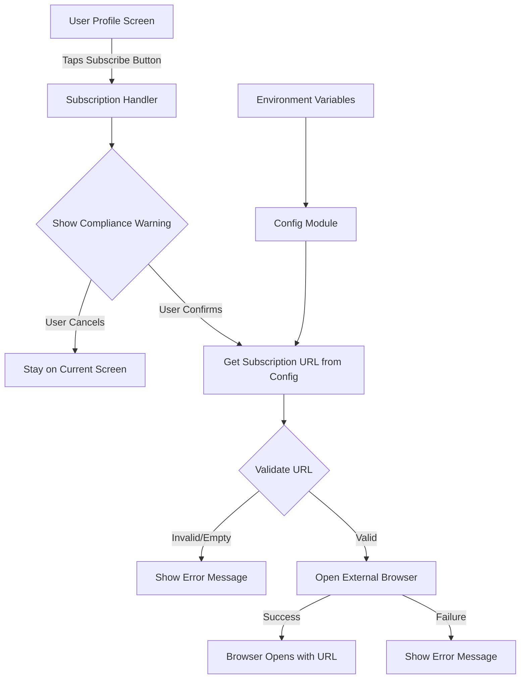

# Design Document

## Overview

This design implements a compliant external subscription flow for the Deporte Más mobile application. Users will be redirected to an external web platform (`https://deporte-mas-platform.vercel.app/`) to complete subscription purchases. The implementation follows Apple App Store and Google Play Store policies by displaying a mandatory compliance warning before external navigation.

The solution uses Expo's `expo-web-browser` for cross-platform browser handling, `expo-constants` for environment variable access, and React Native's `Alert` API for the compliance warning dialog. The architecture is modular, allowing easy testing and future modifications.

## Architecture



### Data Flow
1. User interaction triggers subscription flow
2. Compliance warning displays (blocking)
3. User confirmation proceeds to URL retrieval
4. Config module provides environment-based URL
5. Browser API opens external link
6. Error handling at each step

## Components and Interfaces

### 1. Configuration Module (`config/subscription.ts`)

**Purpose:** Centralized configuration for subscription-related constants and environment variables.

**Interface:**
```typescript
export interface SubscriptionConfig {
  subscriptionUrl: string;
  fallbackUrl: string;
}

export const getSubscriptionUrl = (): string;
```

**Implementation Details:**
- Uses `expo-constants` to access `EXPO_PUBLIC_SUBSCRIPTION_URL`
- Provides fallback to `https://deporte-mas-platform.vercel.app/`
- Validates URL format before returning
- Logs warning if environment variable is missing

**References Requirements:** 1.1, 1.2, 1.3

---

### 2. Compliance Warning Component (`components/SubscriptionWarningDialog.tsx`)

**Purpose:** Displays store-compliant warning before external navigation.

**Interface:**
```typescript
interface SubscriptionWarningDialogProps {
  onConfirm: () => void;
  onCancel: () => void;
  visible: boolean;
}

export const showSubscriptionWarning = (
  onConfirm: () => void,
  onCancel?: () => void
): void;
```

**Implementation Details:**
- Uses React Native `Alert.alert()` for native dialog
- Includes two buttons: "Cancelar" and "Continuar"
- Spanish warning text compliant with store policies
- Warning copy includes:
  - Notice of external website redirect
  - Mention that app store protections don't apply
  - Clear call-to-action

**Warning Copy (Spanish):**
```
Título: "Suscripción Externa"

Mensaje: "Estás a punto de ser redirigido a un sitio web externo para completar tu suscripción.

Las compras realizadas fuera de la tienda de aplicaciones no están cubiertas por las políticas de protección de Apple/Google.

¿Deseas continuar?"

Botones: [Cancelar] [Continuar]
```

**References Requirements:** 2.1, 2.2, 2.3, 2.4, 5.1, 5.2, 5.3, 5.4

---

### 3. Subscription Service (`services/subscriptionService.ts`)

**Purpose:** Handles subscription flow orchestration and external browser navigation.

**Interface:**
```typescript
export interface SubscriptionServiceResult {
  success: boolean;
  error?: string;
}

export const initiateSubscription = async (): Promise<SubscriptionServiceResult>;
export const openSubscriptionUrl = async (url: string): Promise<SubscriptionServiceResult>;
```

**Implementation Details:**
- Uses `expo-web-browser` for cross-platform browser opening
- Handles iOS, Android, and Web platforms
- Error handling for browser failures
- Platform-specific behavior:
  - **iOS/Android:** Opens in-app browser or default browser
  - **Web:** Opens in new tab using `window.open()`

**Flow:**
1. Call `initiateSubscription()`
2. Display compliance warning
3. On user confirmation, retrieve URL from config
4. Validate URL
5. Call `openSubscriptionUrl(url)`
6. Handle success/error states

**References Requirements:** 3.1, 3.2, 3.3, 3.4, 6.1, 6.2, 6.3, 6.4, 7.1, 7.2, 7.3, 7.4

---

### 4. Profile Screen Integration (`app/profile.tsx`)

**Purpose:** Add subscription trigger point in user profile.

**Updates Required:**
- Add "Suscribirse" or "Mejorar Plan" button in profile header or points section
- Wire button to `initiateSubscription()` handler
- Display loading state during subscription flow
- Handle errors with user-friendly messages

**UI Placement Options:**
1. **Option A:** Add button below "Tus puntos" section
2. **Option B:** Add icon in header next to existing icons
3. **Option C:** Add premium badge/banner at top of profile

**Recommended:** Option A - Clear, prominent placement without cluttering header

**References Requirements:** 4.1, 4.2, 4.3

---

### 5. Utility Functions (`utils/urlValidator.ts`)

**Purpose:** URL validation and sanitization.

**Interface:**
```typescript
export const isValidUrl = (url: string): boolean;
export const sanitizeUrl = (url: string): string;
```

**Implementation Details:**
- Validates URL format using URL constructor
- Ensures HTTPS protocol
- Checks for non-empty hostname
- Sanitizes input by trimming whitespace

**References Requirements:** 6.2

---

## Data Models

### Environment Variables
```typescript
// .env.example
EXPO_PUBLIC_SUBSCRIPTION_URL=https://deporte-mas-platform.vercel.app/

// app.json (for Expo configuration)
{
  "expo": {
    "extra": {
      "subscriptionUrl": process.env.EXPO_PUBLIC_SUBSCRIPTION_URL
    }
  }
}
```

### Error Types
```typescript
enum SubscriptionError {
  BROWSER_FAILED = 'BROWSER_FAILED',
  INVALID_URL = 'INVALID_URL',
  USER_CANCELLED = 'USER_CANCELLED',
  UNKNOWN = 'UNKNOWN'
}

interface SubscriptionErrorDetails {
  code: SubscriptionError;
  message: string;
  userMessage: string; // Spanish, user-friendly
}
```

---

## Error Handling

### Error Scenarios and Responses

| Scenario | Detection | User Message (Spanish) | Technical Action |
|----------|-----------|----------------------|------------------|
| Browser fails to open | `WebBrowser.openBrowserAsync()` returns error | "No se pudo abrir el navegador. Por favor, intenta nuevamente." | Log error, allow retry |
| URL is empty/undefined | Config module returns empty string | "Error de configuración. Por favor, contacta soporte." | Log error, prevent navigation |
| URL is malformed | URL validation fails | "Error de configuración. Por favor, contacta soporte." | Log error, prevent navigation |
| User cancels warning | User taps "Cancelar" | No message (silent cancellation) | Return to current screen |
| Network unavailable | Browser cannot connect | Handled by browser/OS | OS-level error message |
| Permission denied | WebBrowser permission error (unlikely) | "Permiso denegado. Verifica la configuración de tu dispositivo." | Log error, show settings hint |

**Error Logging:**
- All errors logged to console in development
- Production: Consider integration with error tracking service (Sentry, etc.)
- Include error code, timestamp, platform, and URL (sanitized)

**References Requirements:** 6.1, 6.2, 6.3, 6.4

---

## Platform-Specific Considerations

### iOS
- Uses `expo-web-browser` which opens SFSafariViewController
- User can dismiss browser and return to app seamlessly
- Deep linking can be configured for return flow (future enhancement)
- Compliance warning must be shown every time (no "don't show again")

### Android
- Uses `expo-web-browser` which opens Chrome Custom Tabs or default browser
- Similar behavior to iOS
- Handles back button appropriately
- Compliance warning required on every access

### Web
- Opens subscription URL in new tab using `window.open(url, '_blank')`
- Popup blockers may prevent opening - handle gracefully
- Warning still displayed for consistency
- Consider `window.location.href` for same-tab navigation (design decision)

**References Requirements:** 7.1, 7.2, 7.3, 7.4

---

## File Structure

```
deporte-mas-mobile/
├── app/
│   └── profile.tsx                          # Updated with subscription button
├── config/
│   └── subscription.ts                       # Environment config
├── services/
│   └── subscriptionService.ts                # Subscription orchestration
├── utils/
│   └── urlValidator.ts                       # URL validation
├── constants/
│   └── messages.ts                           # User-facing messages (Spanish)
├── .env                                      # Environment variables (gitignored)
└── .env.example                              # Template for environment variables
```

---

## Testing Strategy

### Unit Tests
1. **Config Module:**
   - Returns correct URL when env var is set
   - Falls back to default URL when env var is missing
   - Validates URL format

2. **URL Validator:**
   - Accepts valid HTTPS URLs
   - Rejects invalid URLs
   - Sanitizes whitespace

3. **Subscription Service:**
   - Mock browser API calls
   - Test error handling for all scenarios
   - Verify platform-specific logic

### Integration Tests
1. **Profile Screen:**
   - Button triggers subscription flow
   - Warning displays correctly
   - User confirmation opens browser
   - User cancellation returns to screen

### Manual Testing Checklist
- [ ] Test on iOS device
- [ ] Test on Android device
- [ ] Test on web browser
- [ ] Verify warning text is readable and compliant
- [ ] Test with valid env var
- [ ] Test with missing env var (should use fallback)
- [ ] Test browser open success
- [ ] Test browser open failure (simulate)
- [ ] Test user cancellation
- [ ] Test URL opens correctly in external browser

---

## Security Considerations

1. **URL Validation:**
   - Only HTTPS URLs allowed
   - Validate URL before opening to prevent protocol injection
   - Sanitize user-provided data (if applicable in future)

2. **Environment Variables:**
   - Use `EXPO_PUBLIC_` prefix for client-exposed variables
   - Document expected format in `.env.example`
   - Never commit actual `.env` file

3. **User Data:**
   - Do not pass sensitive user data in URL query params
   - Use secure session handling on web platform
   - Consider deep linking with secure tokens for return flow (future)

---

## Future Enhancements

1. **Return Flow:**
   - Implement deep linking to return user to app after subscription
   - Show success/failure message based on return URL parameters

2. **Subscription Status:**
   - Cache user subscription status locally
   - Sync with backend on app launch
   - Update UI based on subscription state

3. **Analytics:**
   - Track subscription button clicks
   - Track warning confirmation/cancellation rates
   - Track browser open success/failure rates
   - Monitor conversion funnel

4. **A/B Testing:**
   - Test different warning copy variations
   - Test button placement options
   - Measure impact on conversion rates

---

## Dependencies

**New Dependencies (to be added):**
- None (all required packages already in `package.json`)

**Existing Dependencies Used:**
- `expo-web-browser` (~15.0.7) - Already installed
- `expo-constants` (~18.0.9) - Already installed
- `react-native` (0.81.4) - Already installed

**Environment Setup:**
- Create `.env` file in project root
- Add `EXPO_PUBLIC_SUBSCRIPTION_URL` variable
- Restart Expo dev server after env changes

---

## Migration Plan

### Phase 1: Infrastructure (No user-facing changes)
1. Create config module
2. Create subscription service
3. Create URL validator
4. Add environment variable support
5. Write unit tests

### Phase 2: UI Integration
1. Add subscription button to profile screen
2. Wire up subscription flow
3. Test on all platforms
4. Conduct internal testing

### Phase 3: Deployment
1. Update `.env` for production
2. Deploy to TestFlight (iOS) and Internal Testing (Android)
3. Conduct compliance review
4. Submit to app stores
5. Monitor analytics and error logs

---

## Compliance Verification

### Apple App Store Requirements
- ✅ Display warning before external link
- ✅ Inform users of lack of app store protections
- ✅ Provide clear cancel option
- ✅ Use system alert dialog (not custom modal)

### Google Play Store Requirements
- ✅ Display warning before external link
- ✅ Inform users of external payment processing
- ✅ Provide clear cancel option
- ✅ No misleading language

**Reference Documentation:**
- [Apple App Store Review Guidelines - 3.1.1](https://developer.apple.com/app-store/review/guidelines/#in-app-purchase)
- [Google Play Billing Policy - Developers Using an Alternative Billing System](https://support.google.com/googleplay/android-developer/answer/10281818)

---

## Summary

This design provides a complete, store-compliant solution for external subscription links in the Deporte Más mobile app. The modular architecture allows for easy testing, maintenance, and future enhancements. All requirements are addressed with clear implementation paths, error handling, and platform-specific considerations.

The implementation prioritizes user experience while maintaining strict compliance with Apple and Google store policies. The warning dialog uses native alerts for familiarity, and the flow is straightforward: tap → warn → confirm → open browser.
