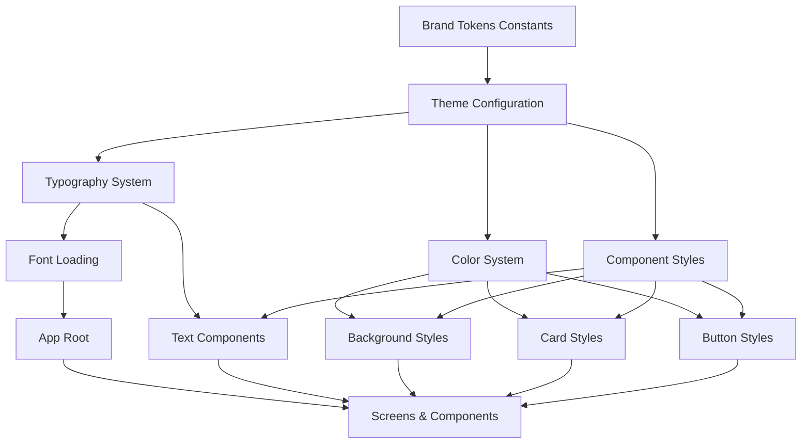

# Design Document: Mobile App Branding System

## Overview

This design implements a centralized branding system for the Deporte Más mobile application built with Expo and React Native. The system provides a type-safe, scalable theme architecture that includes color tokens, typography configuration, and reusable component styling patterns. The design leverages React Native's StyleSheet API and Expo's font loading system while maintaining consistency with the brand identity established in the reference mockups.

The architecture follows a constants-based approach where all branding tokens are defined in a single source of truth, making updates and maintenance straightforward. Components will reference these tokens instead of hardcoded values, ensuring consistency and enabling future theming capabilities if needed.

## Architecture



### File Structure

```
deporte-mas-mobile/
├── constants/
│   ├── Colors.ts          # Color token definitions
│   ├── Typography.ts      # Typography configuration
│   └── Theme.ts           # Main theme export
├── components/
│   ├── themed/
│   │   ├── ThemedText.tsx      # Typography-aware text component
│   │   ├── ThemedView.tsx      # Background-aware view component
│   │   ├── GradientButton.tsx  # Branded gradient button
│   │   └── Card.tsx            # Branded card components
├── app/
│   └── _layout.tsx        # Root layout with font loading
└── README.md             # Documentation with branding guidelines
```

## Components and Interfaces

### 1. Color System (`constants/Colors.ts`)

**Purpose:** Centralized color token definitions following the brand palette.

**Interface:**
```typescript
export const Colors = {
  background: '#090B1C',
  card: '#111536',
  subCard: '#1D2255',
  text: '#FFFFFF',
  impact: {
    red: '#E12F23',
    blue: '#222DC2',
  },
  gradient: {
    start: '#222DC2',
    end: '#E12F23',
  },
} as const;

export type ColorToken = typeof Colors;
```

**Design Rationale:**
- Uses TypeScript `as const` for compile-time type safety
- Nested structure for related colors (impact, gradient)
- Matches exact hex values from requirements
- _References: Requirements 1.1, 6.2_

### 2. Typography System (`constants/Typography.ts`)

**Purpose:** Font family definitions, loading configuration, and text style utilities.

**Interface:**
```typescript
export const Typography = {
  fonts: {
    title: 'RomaGothic-Bold',    // Loaded from Adobe Fonts
    body: 'Geist-Regular',       // Loaded from Google Fonts
  },
  styles: {
    title: {
      fontFamily: 'RomaGothic-Bold',
      textTransform: 'uppercase' as const,
      color: Colors.text,
    },
    body: {
      fontFamily: 'Geist-Regular',
      color: Colors.text,
    },
  },
} as const;

export type TypographyToken = typeof Typography;
```

**Font Loading Configuration:**
```typescript
export const fontAssets = {
  'RomaGothic-Bold': require('../assets/fonts/RomaGothic-Bold.otf'),
  'Geist-Regular': require('../assets/fonts/Geist-Regular.otf'),
  'Geist-Medium': require('../assets/fonts/Geist-Medium.otf'),
  'Geist-SemiBold': require('../assets/fonts/Geist-SemiBold.otf'),
  'Geist-Bold': require('../assets/fonts/Geist-Bold.otf'),
};
```

**Design Rationale:**
- Expo's `useFonts` hook will load fonts asynchronously
- Provides fallback handling during font loading
- Pre-defined styles enforce uppercase for titles automatically
- Multiple Geist weights for flexibility in body text hierarchy
- _References: Requirements 2.1, 2.2, 2.3, 2.4_

### 3. Theme Configuration (`constants/Theme.ts`)

**Purpose:** Main theme export combining all branding elements.

**Interface:**
```typescript
import { Colors } from './Colors';
import { Typography } from './Typography';

export const Theme = {
  colors: Colors,
  typography: Typography,
  spacing: {
    xs: 4,
    sm: 8,
    md: 16,
    lg: 24,
    xl: 32,
    xxl: 40,
  },
  borderRadius: {
    sm: 8,
    md: 12,
    lg: 16,
  },
} as const;

export type Theme = typeof Theme;
```

**Design Rationale:**
- Single import point for all theme tokens
- Includes spacing and border radius for consistency
- Type-safe with full autocomplete support
- _References: Requirements 7.2, 7.3_

### 4. ThemedText Component (`components/themed/ThemedText.tsx`)

**Purpose:** Text component that automatically applies typography rules.

**Interface:**
```typescript
type ThemedTextProps = TextProps & {
  variant?: 'title' | 'body';
  color?: string;
};

export function ThemedText({
  variant = 'body',
  style,
  children,
  color,
  ...props
}: ThemedTextProps) {
  const textStyle = variant === 'title'
    ? Theme.typography.styles.title
    : Theme.typography.styles.body;

  return (
    <Text
      style={[
        textStyle,
        color && { color },
        style,
      ]}
      {...props}
    >
      {variant === 'title' && typeof children === 'string'
        ? children.toUpperCase()
        : children}
    </Text>
  );
}
```

**Design Rationale:**
- Automatic uppercase transformation for titles
- Extends React Native's Text props for full compatibility
- Style override support for edge cases
- _References: Requirements 2.2, 7.4_

### 5. GradientButton Component (`components/themed/GradientButton.tsx`)

**Purpose:** Branded button with blue-to-red gradient.

**Interface:**
```typescript
import { LinearGradient } from 'expo-linear-gradient';

type GradientButtonProps = {
  onPress: () => void;
  title: string;
  disabled?: boolean;
  style?: ViewStyle;
};

export function GradientButton({
  onPress,
  title,
  disabled = false,
  style,
}: GradientButtonProps) {
  return (
    <TouchableOpacity
      onPress={onPress}
      disabled={disabled}
      activeOpacity={0.8}
      style={style}
    >
      <LinearGradient
        colors={[Theme.colors.gradient.start, Theme.colors.gradient.end]}
        start={{ x: 0, y: 0 }}
        end={{ x: 1, y: 0 }}
        style={styles.gradient}
      >
        <ThemedText variant="title" style={styles.buttonText}>
          {title}
        </ThemedText>
      </LinearGradient>
    </TouchableOpacity>
  );
}

const styles = StyleSheet.create({
  gradient: {
    paddingVertical: 15,
    paddingHorizontal: 30,
    borderRadius: Theme.borderRadius.sm,
    alignItems: 'center',
    justifyContent: 'center',
  },
  buttonText: {
    fontSize: 16,
    fontWeight: '600',
  },
});
```

**Design Rationale:**
- Uses expo-linear-gradient (already in dependencies)
- Horizontal gradient (left to right) matching reference design
- Title text is automatically uppercase via ThemedText
- Active opacity for touch feedback
- _References: Requirements 3.1, 3.2, 3.3, 3.4_

### 6. Card Components (`components/themed/Card.tsx`)

**Purpose:** Branded card containers with proper background hierarchy.

**Interface:**
```typescript
type CardProps = ViewProps & {
  variant?: 'default' | 'sub';
  children: React.ReactNode;
};

export function Card({
  variant = 'default',
  style,
  children,
  ...props
}: CardProps) {
  const backgroundColor = variant === 'default'
    ? Theme.colors.card
    : Theme.colors.subCard;

  return (
    <View
      style={[
        styles.card,
        { backgroundColor },
        style,
      ]}
      {...props}
    >
      {children}
    </View>
  );
}

const styles = StyleSheet.create({
  card: {
    borderRadius: Theme.borderRadius.md,
    padding: Theme.spacing.md,
  },
});
```

**Design Rationale:**
- Two-tier hierarchy (card and sub-card)
- Default padding and border radius
- Extensible via style prop
- _References: Requirements 4.1, 4.2, 4.3, 4.4_

### 7. ThemedView Component (`components/themed/ThemedView.tsx`)

**Purpose:** View component with branded background color for screens.

**Interface:**
```typescript
type ThemedViewProps = ViewProps & {
  children: React.ReactNode;
};

export function ThemedView({ style, children, ...props }: ThemedViewProps) {
  return (
    <View
      style={[
        { backgroundColor: Theme.colors.background, flex: 1 },
        style,
      ]}
      {...props}
    >
      {children}
    </View>
  );
}
```

**Design Rationale:**
- Simple wrapper ensuring consistent screen backgrounds
- Flex: 1 by default for full-screen layouts
- Overridable for special cases
- _References: Requirements 5.1, 5.2, 5.3_

### 8. Root Layout Font Loading (`app/_layout.tsx`)

**Purpose:** Load custom fonts before app renders.

**Implementation:**
```typescript
import { useFonts } from 'expo-font';
import * as SplashScreen from 'expo-splash-screen';
import { useEffect } from 'react';
import { fontAssets } from '../constants/Typography';

SplashScreen.preventAutoHideAsync();

export default function RootLayout() {
  const [fontsLoaded, fontError] = useFonts(fontAssets);

  useEffect(() => {
    if (fontsLoaded || fontError) {
      SplashScreen.hideAsync();
    }
  }, [fontsLoaded, fontError]);

  if (!fontsLoaded && !fontError) {
    return null;
  }

  return (
    <AuthProvider>
      <Stack
        screenOptions={{
          headerShown: false,
          contentStyle: { backgroundColor: Theme.colors.background },
        }}
      />
    </AuthProvider>
  );
}
```

**Design Rationale:**
- Prevents flash of unstyled text (FOUT)
- Uses splash screen while fonts load
- Graceful error handling
- Updates existing _layout.tsx background color to use theme token
- _References: Requirements 2.3, 2.4, 5.1_

## Data Models

### Theme Token Types

```typescript
// Type exports for consuming components
export type ColorName = keyof typeof Colors;
export type FontName = keyof typeof Typography.fonts;
export type SpacingSize = keyof typeof Theme.spacing;
export type BorderRadiusSize = keyof typeof Theme.borderRadius;

// Utility type for styled components
export type ThemedStyle = {
  colors: typeof Colors;
  typography: typeof Typography;
  spacing: typeof Theme.spacing;
  borderRadius: typeof Theme.borderRadius;
};
```

## Error Handling

### Font Loading Failures

**Scenario:** Adobe Fonts or Google Fonts fail to load
**Strategy:**
- Fallback to system fonts (San Francisco on iOS, Roboto on Android)
- Log error for debugging
- App remains functional with default fonts

**Implementation:**
```typescript
if (fontError) {
  console.error('Font loading error:', fontError);
  // App continues with system fonts
}
```

### Invalid Color References

**Scenario:** Developer uses hardcoded color instead of theme token
**Strategy:**
- TypeScript enforcement via ESLint rules (future enhancement)
- Code review checklist in documentation
- Example components demonstrating proper usage

### Gradient Rendering Issues

**Scenario:** Linear gradient fails on specific devices
**Strategy:**
- Fallback to solid color (impact.blue)
- expo-linear-gradient is well-tested, but fallback provides resilience

**Implementation:**
```typescript
// GradientButton with fallback
<View style={{ backgroundColor: Theme.colors.impact.blue }}>
  <LinearGradient
    // gradient props
  />
</View>
```

## Platform-Specific Considerations

### iOS
- Status bar light content style enforced in app.json
- Safe area handling for notched devices
- Font rendering matches native San Francisco metrics

### Android
- Edge-to-edge enabled for immersive experience
- Status bar color matches background
- Material Design ripple effect on buttons (TouchableNativeFeedback option)

### Web
- Gradient support is universal in modern browsers
- Font loading via CSS @font-face as fallback
- Responsive breakpoints for larger screens (future consideration)

## Integration Points

### Existing Components

Update existing screens to use themed components:

**Example: login.tsx**
```typescript
// Before
<View style={styles.container}>
  <Text style={styles.title}>Iniciar Sesión</Text>
</View>

// After
<ThemedView>
  <ThemedText variant="title">Iniciar Sesión</ThemedText>
</ThemedView>
```

### Status Bar Configuration

Update app.json:
```json
{
  "expo": {
    "statusBarStyle": "light-content",
    "statusBarBackgroundColor": "#090B1C",
    "android": {
      "statusBarStyle": "light-content",
      "statusBarBackgroundColor": "#090B1C"
    }
  }
}
```

_References: Requirements 8.1, 8.2_

## Migration Strategy

### Phase 1: Foundation
1. Create constants files (Colors, Typography, Theme)
2. Add font files to assets/fonts/
3. Update _layout.tsx with font loading
4. Update app.json status bar colors

### Phase 2: Component Library
1. Implement ThemedText component
2. Implement ThemedView component
3. Implement GradientButton component
4. Implement Card component

### Phase 3: Screen Updates
1. Update existing screens to use themed components
2. Replace hardcoded colors with theme tokens
3. Apply gradient buttons to CTAs
4. Test on iOS and Android

### Phase 4: Documentation
1. Add branding guidelines to README
2. Include usage examples
3. Document component APIs
4. Add visual reference images

## Performance Considerations

- Font files should be optimized (woff2 for web, OTF for native)
- Theme object is created once (no runtime overhead)
- StyleSheet.create caches styles
- Gradient rendering is GPU-accelerated
- No theme context overhead (static imports only)

## Testing Strategy

### Visual Regression Testing
- Screenshot tests for each themed component
- Compare against reference designs
- Test light/dark mode compatibility (future)

### Unit Tests
- Theme token accessibility
- Component prop variations
- Font loading error states

### Manual Testing Checklist
- [ ] Titles are uppercase
- [ ] Gradient buttons render correctly
- [ ] Card hierarchy is visible
- [ ] Background colors are consistent
- [ ] Fonts load without flash
- [ ] Status bar matches brand colors
- [ ] Touch feedback works on buttons

## Future Enhancements

1. **Dark/Light Mode Toggle**
   - Add theme context for runtime switching
   - Duplicate color tokens for light mode

2. **Animation System**
   - Branded animation timing curves
   - Transition presets for consistent UX

3. **Accessibility**
   - High contrast mode
   - Font scaling support
   - Color blind friendly alternatives

4. **Component Library Expansion**
   - Input fields with brand styling
   - Modal components
   - Navigation tab bar styling
   - Badge components with impact colors

## Success Metrics

The branding system is successfully implemented when:
- ✅ All screens use theme tokens (no hardcoded colors)
- ✅ Typography hierarchy is evident (titles vs body)
- ✅ Gradient buttons are consistent across app
- ✅ Status bar matches brand identity
- ✅ Fonts load reliably on first launch
- ✅ README includes comprehensive guidelines
- ✅ Developers can add new screens without branding questions
- ✅ App matches reference design aesthetics
